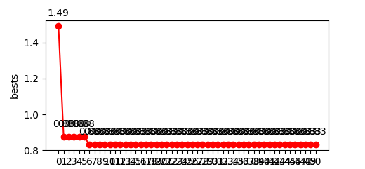

# XEvolutionaryAlgorithm

X algorithm is an evolutionary algorithm created just for evaluating the impact of genetic operators such as mutation, crossover, selection etc. and the control parameters. The control parameters of the algorithm are listed below:

1. NP: number of individuals in population
2. D: Dimension of an individual
3. C: Number of genes coming from the best individual for crossover operation
4. M: Number of genes in an individual being mutated
5. MR: Mutation rate
6. CR: Crossover rate

The algorithm was tested on following objective functions:
1. Sphere
2. Rosenbrock

The algorithm is developed by Dr. Beyza GORKEMLI and this project is created just for a homework that was given from Dr. Beyza GORKEMLI.


## Running 

To run the algorithm, execute the following command:

```
python main.py
```

## Requirements

1. python3
2. python3 libraries:
	1. numpy
	2. matplotlib
	3. scipy
	4. nose


## Experiments

Sphere Function:
Parameters:
1. NP = 100
2. D = 3
3. MaxG = 50
4. CR = 0.5
5. MR = 0.1
6. C = D/3
7. M = D


